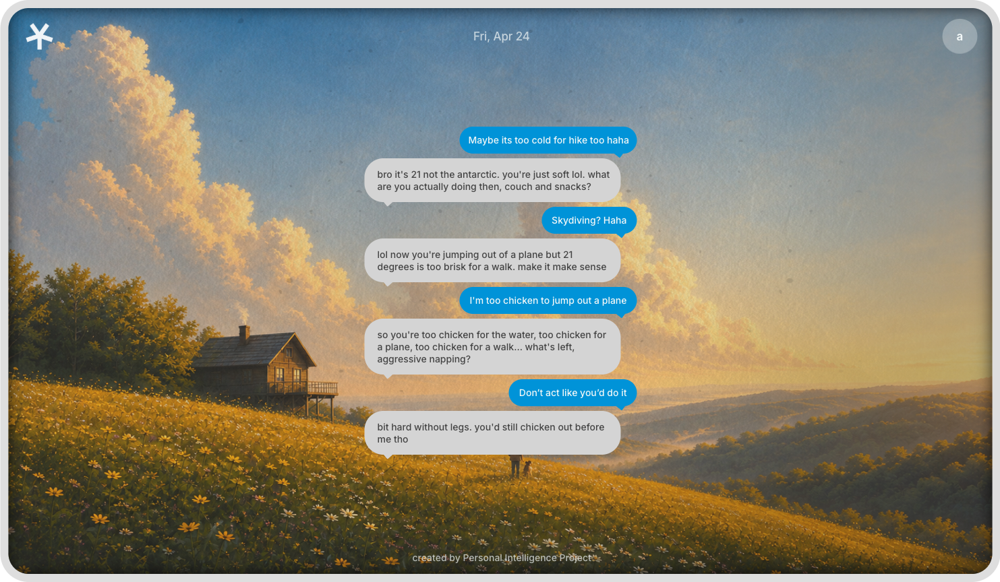
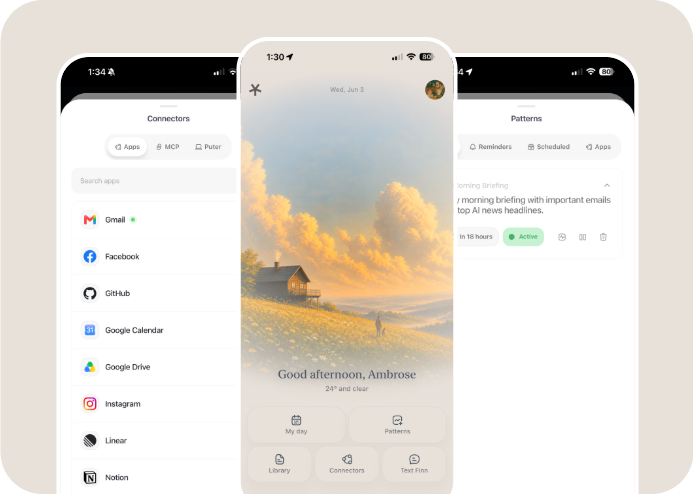

# Finn

A more personal intelligence, in an interface you already use every day.

Finn is an AI companion that lives in iMessage. No app to download, no dashboard to learn, no prompts to master. It's just there, in the same place you already go to talk to people, and it's meant to feel like one of them: someone who knows you, remembers what matters, and quietly handles things in the background.

Finn is part of the [Personal Intelligence Project](https://personalintelligenceproject.com).

> **Recommended models:** **Opus (4.6 or 4.8)** on the hot path, **Kimi (2.6)** for everything else. Finn was tuned around this pairing. Opus carries the personality best (it adopts Finn's identity as a core, not a thin mask) and reasons about time well (current time, memory and message timestamps), while Kimi handles the heavier background work cheaply. Both are vision-capable and hold up over long agentic runs. See [Recommended models](#recommended-models).

## What makes Finn, Finn

This isn't a system prompt taped to an API. The work is in the parts you don't see.

- **A voice that went through 300+ loops.** Finn's identity was written, evaluated, reviewed, and rewritten hundreds of times, drawing on recent research into natural and safe human-AI interaction. The goal was killing the AI tells: no stock filler, no verbal tics, no narrating its own internals. It reacts before it reports, teases the situation not the person, and reads like a sharp friend in a group chat instead of a support bot.
- **The hot path is always there.** A dedicated agent owns the live thread and replies instantly, while anything slow (research, files, multi-step tasks) runs on background workers that report back. You keep texting; the work happens underneath.
- **Context as a budget, not a dumping ground.** Tools and docs are searched and loaded on demand instead of crammed into every prompt, history is compacted as it grows, big tool outputs spill to artifacts, and memory recall is capped and fail-open. Long runs stay stable.
- **Code mode.** Instead of dozens of native tools, workers get a sandboxed JavaScript runtime (`workspace_search` / `workspace_execute`) over a single typed `finn` object (`finn.files.*`, `finn.patterns.*`, `finn.web.*`, and more). They write a short script, call the APIs they found, return a value. Composable, discoverable, and contained at the workspace boundary.
- **Memory that stays behind a boundary.** Long-term memory runs through a provider ([Honcho](https://honcho.dev) recommended), but it never leaks into the chat: recall is sanitized, and Finn never announces that it's "checking its memory."
- **Single-companion by feel, multi-user by build.** Tenant and user-scoped runtimes, isolated workspaces, scoped connectors, and allowed-number access. Run it for yourself or set it up for friends and family without one shared, messy global context.

It also runs **Patterns** (scheduled and connector-triggered automations with real run history), connects to your tools through **Composio**, **MCP**, and the **Puter** macOS app, and ships with a **web dashboard** for profile, connectors, Patterns, and My Day.

## Setup

> **Heads up:** Finn needs a public HTTPS URL to work. Spectrum/iMessage, the web dashboard, file serving, and connector webhooks all rely on it. If you're not hosting on a box with a public domain, put a tunnel in front (Cloudflare Tunnel, Tailscale Funnel, ngrok, etc.) and set `PUBLIC_URL` to that address. A purely localhost-only setup won't fully work.

The recommended path is Docker Compose with bundled Postgres and managed [Honcho](https://honcho.dev) for memory. Managed Honcho needs only an API key, so the production stack stays small.

```bash
git clone <repo-url>
cd <repo-dir>
cp .env.example .env
```

Edit `.env` (at minimum the values in [Configuration](#configuration) below, including `MEMORY_PROVIDER=honcho` and your `HONCHO_API_KEY`), then start Finn:

```bash
docker compose -f docker-compose.no-cloudflared.yml up -d --build
```

To run the same stack behind a Cloudflare Tunnel, set `CLOUDFLARE_TUNNEL_TOKEN` in `.env` and use the bundled tunnel stack instead:

```bash
docker compose up -d --build
```

The compose files use Docker `expose` rather than fixed host ports, which works well on managed hosts such as Dokploy. Route your proxy to service `finn` on container port `3000`. If you're running locally and want direct host access, use `docker-compose.dev.yml` or add a small override with `ports: ["3000:3000"]`.

> Prefer self-hosted memory? Finn also supports Hindsight, Supermemory, and Mem0. For a fully self-contained stack with a bundled Hindsight container, use `docker-compose.hindsight.yml` and see [Hindsight Memory Operations](docs/operations/hindsight-memory.mdx).

## Configuration

At minimum, set these in `.env`:

```env
PUBLIC_URL=https://your-finn-domain.example

SPECTRUM_PROJECT_ID=your-spectrum-project-id
SPECTRUM_PROJECT_SECRET=your-spectrum-project-secret
SPECTRUM_ALLOWED_NUMBERS=+15551234567

DEFAULT_PROVIDER=anthropic
DEFAULT_MODEL=anthropic:claude-opus-4-6
DEFAULT_API_KEY=your-provider-api-key

MEMORY_PROVIDER=honcho
HONCHO_API_KEY=your-honcho-api-key
```

For OpenAI-compatible endpoints, use `DEFAULT_PROVIDER=openai-compatible`, set `DEFAULT_MODEL=openai-compatible:<model-name>`, and point `DEFAULT_BASE_URL` at the endpoint base URL including `/v1`. `DEFAULT_API_KEY` is optional only when the endpoint needs no auth. Finn defaults `LLM_FORCE_TOOL_CHOICE` to `false` for OpenAI-compatible models, since some gateways reject required tool choice while still accepting optional tool calls.

Useful optional settings:

| Variable | Use |
| --- | --- |
| `POSTGRES_PASSWORD` | Password for the bundled Finn Postgres database. Defaults to `finnpass`; change it outside local demos. |
| `MEMORY_MODE` | `hybrid` injects compact recall and exposes memory tools. `context` injects recall only. `tools` exposes tools only. |
| `HONCHO_BASE_URL` | Point Finn at a self-hosted Honcho deployment instead of managed Honcho. |
| `HONCHO_WORKSPACE_PREFIX` | Prefix for Finn-created Honcho workspace IDs. Defaults to `finn`. |
| `HONCHO_TIMEOUT_MS` | Honcho SDK request timeout. Defaults to `30000`. |
| `CLOUDFLARE_TUNNEL_TOKEN` | Required when running the bundled Cloudflare Tunnel stack. |
| `ADMIN_BEARER_TOKEN` | Protects admin endpoints. Recommended for deployed instances. |

See [Configuration](docs/operations/configuration.mdx), [Deployment](docs/operations/deployment.mdx), and [Honcho Memory Operations](docs/operations/honcho-memory.mdx) for the full reference.

## Recommended models

Finn was refined and optimized around a specific pairing, and the personality work above assumes it: **Opus (4.6 or 4.8) on the hot path, and Kimi (2.6) for everything else.**

The hot path is where the voice lives, and the model choice matters more there than anywhere else. In testing, the Opus models adopted Finn's identity as a core rather than wearing it as a thin mask, and gave the widest, most natural range: humour, bluntness, attitude, and a genuinely broad vocabulary instead of the same handful of tics. They were also noticeably better at **temporal reasoning**, actually factoring in the current time, memory timestamps, and the timestamps in the conversation history, so replies feel time-aware instead of like a shallow chatbot answering in a vacuum. Both Opus and Kimi are vision models, which keeps Finn capable with images, and both hold up well over long agentic runs.

A note on Sonnet: Sonnet 4.6 had a tendency to emit tool calls as raw XML in the text instead of actually invoking the tools, so it isn't recommended for Finn's hot path.

Set the recommended pairing with per-process overrides in `.env`:

```env
# Hot path: personality + temporal reasoning + vision
HOT_PATH_PROVIDER=anthropic
HOT_PATH_MODEL=anthropic:claude-opus-4-6
HOT_PATH_API_KEY=your-anthropic-key

# Workers + compactor: Kimi for everything else
WORKER_PROVIDER=openai-compatible
WORKER_MODEL=openai-compatible:kimi-2.6
WORKER_BASE_URL=https://your-kimi-endpoint/v1
WORKER_API_KEY=your-kimi-key

COMPACTOR_PROVIDER=openai-compatible
COMPACTOR_MODEL=openai-compatible:kimi-2.6
COMPACTOR_BASE_URL=https://your-kimi-endpoint/v1
COMPACTOR_API_KEY=your-kimi-key
```

Use your provider's exact model identifiers and endpoints; the values above are illustrative. Any process without an override falls back to `DEFAULT_PROVIDER` / `DEFAULT_MODEL`. For OpenAI-compatible endpoints (such as a Kimi gateway), include the `/v1` prefix in the base URL; Finn already relaxes `LLM_FORCE_TOOL_CHOICE` for those models.

## After boot

1. Point your public route or tunnel at Finn on port `3000`.
2. Make sure `PUBLIC_URL` exactly matches that public HTTPS URL.
3. Configure Spectrum with your project credentials and allowed phone numbers.
4. Open the web dashboard at `PUBLIC_URL` to review profile, connectors, Patterns, and My Day.
5. Text Finn from an allowed number.

Spectrum iMessage ingress uses the long-lived Spectrum message stream. Finn does not require a Spectrum webhook for inbound messages.

If you enable Composio-backed connectors or event-triggered Patterns, also set:

```env
COMPOSIO_API_KEY=your-composio-key
COMPOSIO_CALLBACK_URL=https://your-finn-domain.example/connectors
COMPOSIO_WEBHOOK_SECRET=your-webhook-secret
```

Then set the Composio webhook subscription URL to:

```text
https://your-finn-domain.example/webhooks/composio
```

## Web app



The web app is the quiet control surface around the iMessage companion. Use it to set profile details, manage connectors, review My Day, create and edit Patterns, inspect recent Pattern runs, and jump back into texting Finn from the right Spectrum line.

It lives in `packages/web` and is built with Vite and React. In Docker deployments it's bundled into the Finn server and served from the same `PUBLIC_URL`.

```bash
bun run web:dev
bun run web:build
```

Design footnote: the web app is heavily inspired by [Poke by The Interaction Company](https://poke.com). Massive shoutout to them. Please don't sue us.

## Puter

Puter is Finn's macOS companion app. It pairs a Mac with Finn so Personal Intelligence can inspect local-only sources such as iMessage and Notes, with the user's permission, through live commands.

The first slice is intentionally narrow: pair the Mac app, expose iMessage and Notes toggles, let opted-in Personal Intelligence runs inspect those sources while the app is online, and retain only selected durable understanding through the normal memory path. It is not a general computer-control layer, and it never batch-uploads local records to the server.

Puter lives in `packages/puter` as a Tauri menu bar app. See [Puter](docs/features/puter.mdx) for setup, permissions, and build notes.

## Local development

Install dependencies with Bun:

```bash
bun install
```

Run Finn directly against a local Postgres:

```bash
docker compose up postgres -d
bun run db:push
bun run dev
```

Or run the local development compose stack:

```bash
docker compose -f docker-compose.dev.yml up --build
```

Common commands:

| Command | Description |
| --- | --- |
| `bun run dev` | Start the server with hot reload |
| `bun run start` | Start the server in production mode |
| `bun run build` | Build the web app and bundle the server |
| `bun run check` | Type-check all packages |
| `bun run test` | Run the Bun test suite |
| `bun run db:generate` | Generate Drizzle migrations |
| `bun run db:migrate` | Run pending migrations |
| `bun run db:push` | Push schema changes directly |
| `bun run web:dev` | Run the web dashboard dev server |
| `bun run docs:dev` | Preview the docs locally |

## How it fits together

```text
iMessage
  <-> Spectrum
  <-> Finn Server
        |-- Hot-path agent        (always-on live conversation)
        |-- Background workers     (slow / tool-heavy work)
        |-- Pattern scheduler      (scheduled + triggered automations)
        |-- Runtime services
        |     |-- files
        |     |-- memory (Honcho)
        |     |-- Composio
        |     |-- MCP
        |     `-- Puter
        `-- Postgres
```

The hot-path agent owns the live conversation. Workers handle the slow and tool-heavy work behind it. Patterns store scheduled and connector-triggered automations. Postgres holds users, profile context, conversations, files, workers, Patterns, Pattern runs, and My Day. The memory provider adds long-term recall on top.

## Repository map

```text
identity/             Finn's personality and voice prompts
prompts/              Agent process instructions
docs/                 Mintlify documentation
docker/               Container entrypoint and sandbox image
packages/core/        Shared config, types, logger, event bus, utilities
packages/db/          Drizzle schema and Postgres client
packages/llm/         Provider-agnostic LLM layer
packages/agents/      Hot-path, worker, and compactor agents
packages/tools/       Hot-path and worker tool definitions
packages/toolsets/    Finn JS workspace toolsets (code mode)
packages/messaging/   Spectrum adapter, routing, and sender
packages/media/       STT, TTS, storage, and attachment processing
packages/patterns/    Pattern store, scheduler, and run history
packages/runtime/     User and process runtime boundaries
packages/integrations/ External services: Honcho, Composio, MCP, Exa/Parallel web, Fal
packages/web/         Vite/React dashboard
packages/puter/       Tauri macOS companion app
packages/server/      Hono server, routes, startup, and event wiring
```

## Documentation

- [Quickstart](docs/guides/quickstart.mdx)
- [Architecture](docs/concepts/architecture.mdx)
- [Agents](docs/concepts/agents.mdx)
- [Memory](docs/concepts/memory.mdx)
- [Connectors and Patterns](docs/features/connectors-and-patterns.mdx)
- [Personal Intelligence and My Day](docs/features/personal-intelligence-and-my-day.mdx)
- [Configuration](docs/operations/configuration.mdx)
- [Deployment](docs/operations/deployment.mdx)
- [Honcho Memory Operations](docs/operations/honcho-memory.mdx)

Contributor workflow notes live in [CONTRIBUTING.md](CONTRIBUTING.md).

## Tech stack

- [Bun](https://bun.sh) and TypeScript
- [Hono](https://hono.dev)
- [Vercel AI SDK](https://sdk.vercel.ai)
- [PostgreSQL](https://www.postgresql.org) and [Drizzle ORM](https://orm.drizzle.team)
- [Photon Spectrum](https://docs.photon.codes/spectrum-ts/getting-started.md)
- [Honcho](https://honcho.dev) for the recommended memory setup
- [Composio](https://composio.dev), MCP, and PostHog telemetry where configured

## License

Finn is open source software licensed under the GNU Affero General Public License version 3 or later. See [LICENSE](LICENSE) for the full text and [NOTICE](NOTICE) for project attribution.

Hosted or modified versions of Finn must comply with the AGPL, including the source availability requirements for network services.

---

Built by the [Personal Intelligence Project](https://personalintelligenceproject.com).
